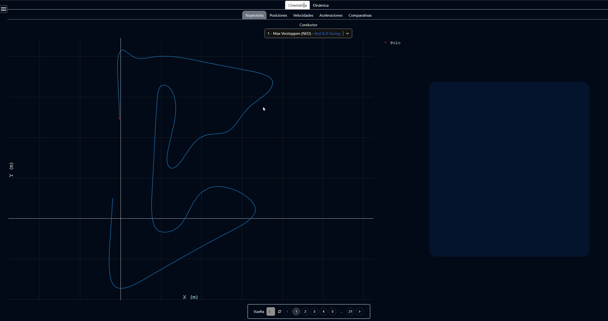
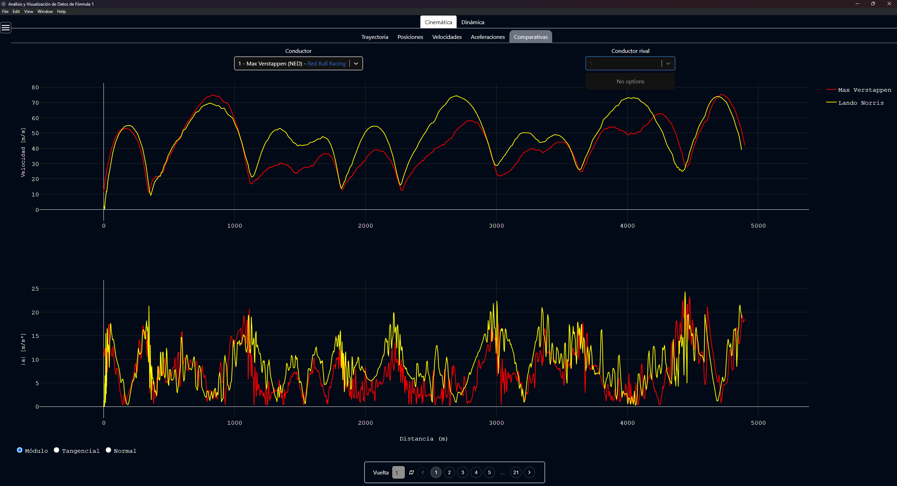
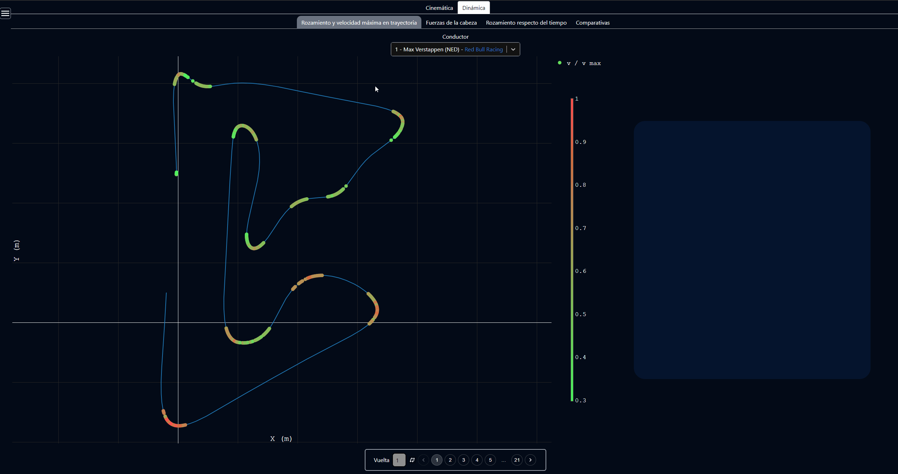
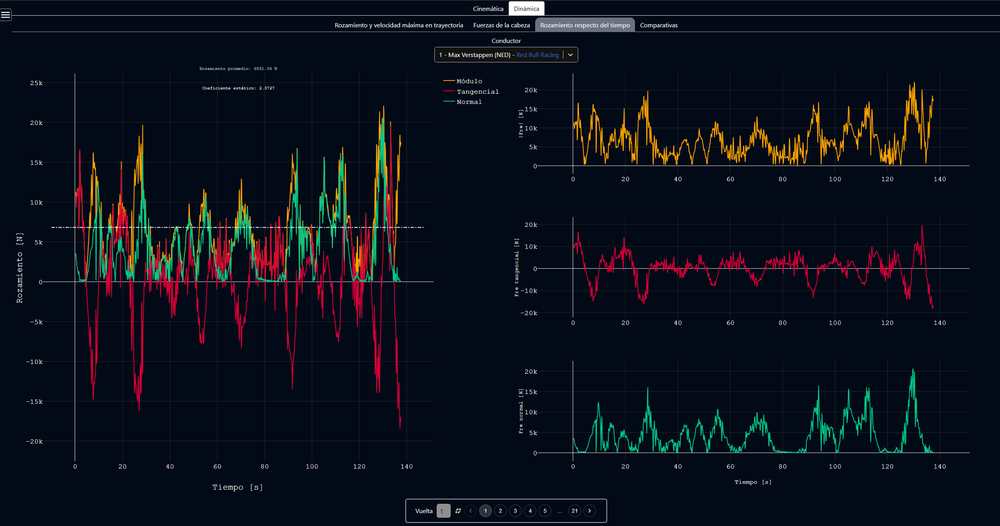

# Formula 1 Analytics and Visualization

A full-stack application to track Formula 1 driver performance and analyze physical data

## Table of Contents
- [Screenshots](#screenshots)
- [About The Project](#about-the-project)
- [Key features](#key-features)
- [Tech Stack](#tech-stack)
- [Project Structure](#project-structure)
- [Getting Started](#getting-started)
- [API Documentation](#api-documentation)
- [Other commands](#other-commands)
- [Production build](#production-build)
- [Developers](#developers)

## Screenshots
<div align="center">
  
  
  
  
</div>

## About The Project

This is a full-stack desktop application developed as a project for the "Physics I" course. It retrieves telemetry for any Formula 1 race, and analyzes metrics like speed, acceleration and friction.

The Electron desktop app serves a React frontend, which communicates with a local Python FastAPI server handling the data acquisition and processing.

## Key features
- **Choose (almost) Any Race**: Any professional race with telemetry can be selected.
- **Kinematics**: Calculate and plot trajectory, speed and acceleration.
- **Dynamics**: Calculate friction and neck forces.
- **Comparisons**: Compare speed, acceleration or friction between drivers.

## Tech Stack
- **Desktop Application**: Electron
- **Frontend**: React
- **Backend**: Python, with FastAPI
- **UI & Styling:** Tailwind CSS
- **Vectors & dataframes**: Pandas, Numpy
- **Telemetry**: FastF1
- **Graphs**: Plotly.js

## Project Structure

The repository is organized to clearly separate the desktop environment, the user interface, and the data processing backend:

```text
formula1-fisica/
├── api/                # Python FastAPI backend (telemetry processing, physics calculations)
├── client/             # React frontend (UI components, Plotly charts, Tailwind styling)
├── main.js             # Electron entry point (desktop window management and IPC communication)
├── package.json        # Node.js dependencies and execution scripts
└── ...
```

## Getting Started

### Prerequisites
- Node.js
- Python

### Installation
1. Clone the repository:
    ```bash
    git clone [https://github.com/leodreizzen/formula1-fisica](https://github.com/leodreizzen/formula1-fisica)
    ```
2. Install all dependencies:
    ```bash
    npm install
    ```
   *Note: This command will automatically create a Python virtual environment (`venv`) and install all required Python packages.*

3. Run the development server and desktop application:
    ```bash
    npm run dev
    ```

## API Documentation
During development, you can access the interactive API documentation (Swagger UI) at:
`http://localhost:3002/docs`

*(For the static OpenAPI Spec, see the [api/apidoc.yaml](api/apidoc.yaml) file).*

## Other commands
Run backend and electron app only (without React frontend):
```bash
  npm run electron
``` 

Run Python backend only:
```bash
  npm run python
```

Run React frontend only:
```bash
  npm run react-dev
```

## Production build
To create an installer, run:
```bash
  npm run build
```
The installer will be created in the `build` folder.

## Developers
This project was collaboratively developed by a team of 10 students for the "Physics I" course:
- Ezequiel Aguilar --- [GitHub profile](https://github.com/EzeAguilar)
- Joaquín Aravena --- [GitHub profile](https://github.com/joaquinaravena)
- Lucas Bazán --- [GitHub profile](https://github.com/LucasBazan28)
- Leonardo Dreizzen --- [GitHub profile](https://github.com/leodreizzen)
- Franco Feuilles --- [GitHub profile](https://github.com/francofeuilles)
- Julián Gallardo --- [GitHub profile](https://github.com/JulianGallardo)
- Guido Reale --- [GitHub profile](https://github.com/Guidoreale)
- Juan Ignacio Rodríguez Mariani --- [GitHub profile](https://github.com/JuaniRMariani)
- Ian Sebalt --- [GitHub profile](https://github.com/IanSebalt)
- Rocío Zentrigen --- [GitHub profile](https://github.com/Ro1407)